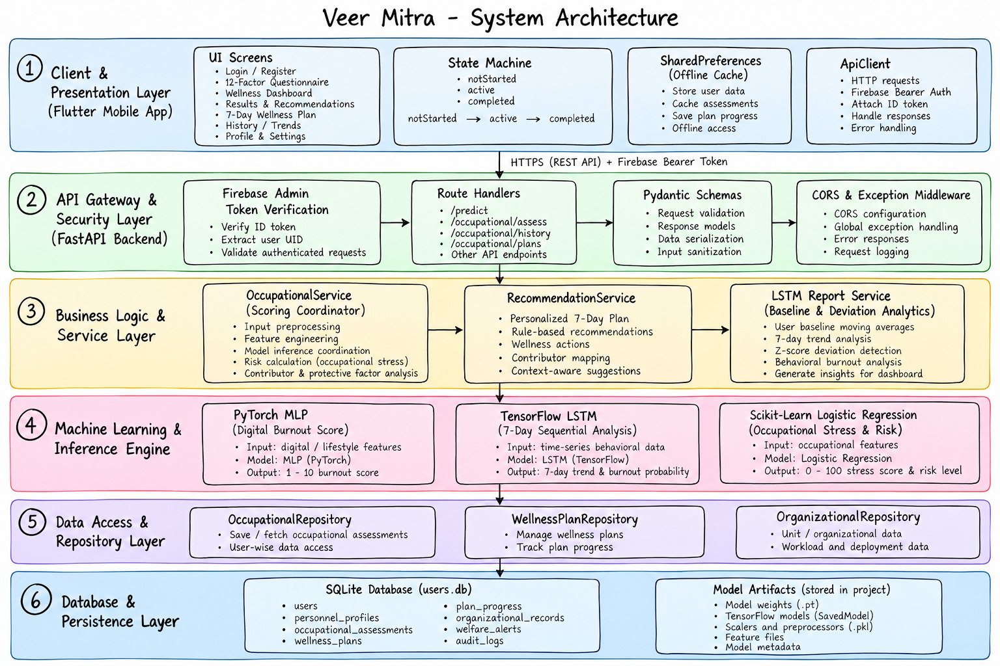
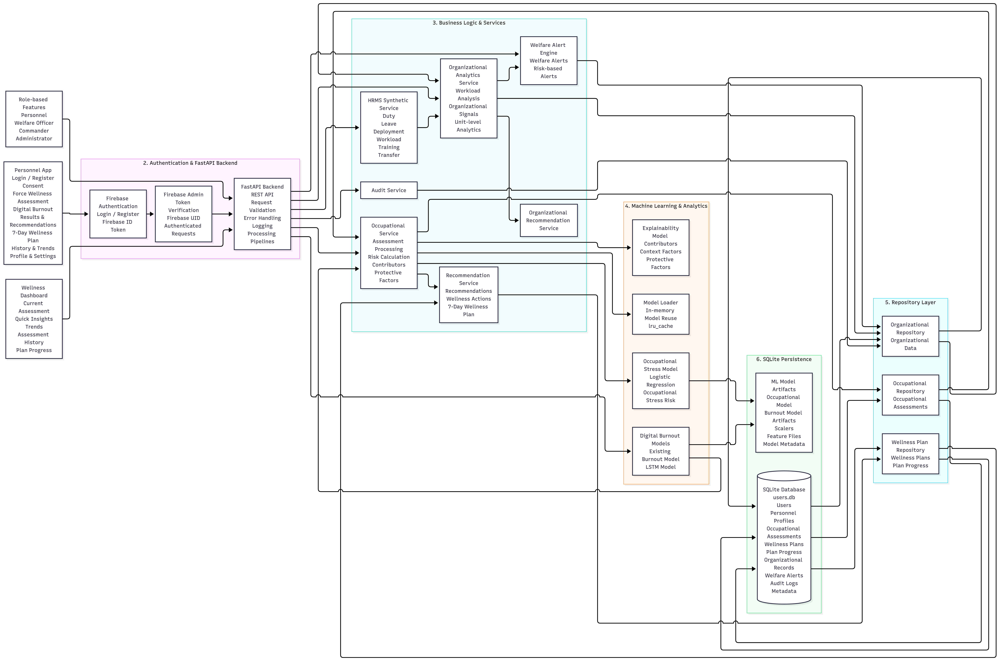
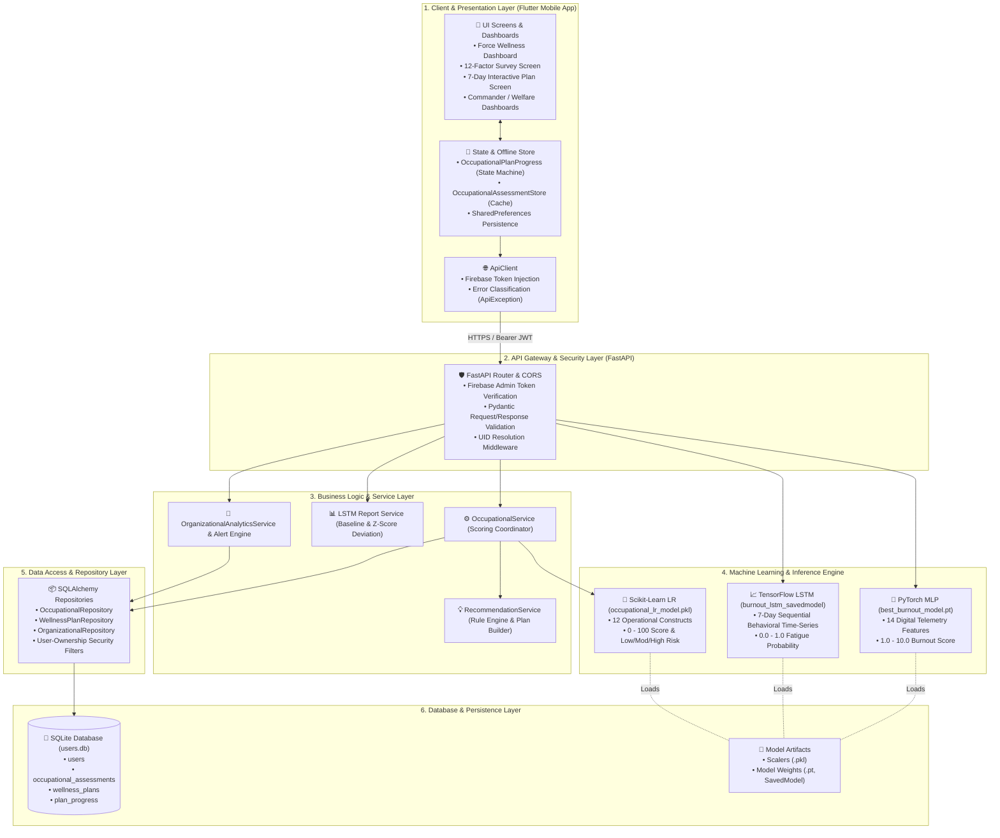

# 🛡️ VEER MITRA (Centralized CFPZA)
### *Comprehensive Digital Wellness & Occupational Stress Intelligence Platform*

[](https://fastapi.tiangolo.com)
[](https://flutter.dev)
[](https://pytorch.org)
[](https://tensorflow.org)
[](https://firebase.google.com)
[](https://sqlite.org)

---

## 📌 Executive Summary

**Veer Mitra (Centralized CFPZA)** is an institutional-grade, full-stack wellness and occupational stress monitoring platform designed for defense, police, and high-demand operational personnel. It unifies **continuous digital habit telemetry**, **structured occupational stress assessments**, **multi-model machine learning analytics**, and **dynamic 7-day recovery plans** into a single privacy-first system.

---

## 🎯 Smart India Hackathon (SIH 2026) Problem Statement

| Attribute | Details |
| :--- | :--- |
| **Problem Statement ID** | `20180` |
| **Title** | **AI-Based Predictive Personnel Stress and Welfare Monitoring System for Uniformed Forces** |
| **Ministry / Organization** | **Ministry of Home Affairs (MHA)** |
| **Department** | **Central Reserve Police Force (CRPF)**, Police II Division |
| **Category** | Software |
| **Theme** | MedTech / BioTech / HealthTech |

### 📖 Problem Background & Context
Personnel serving in **Central Armed Police Forces (CAPFs)**, Armed Forces, and other uniformed services operate under physically demanding, psychologically stressful, and hazardous conditions. Extended deployments, operational pressures, separation from families, irregular working hours, and exposure to high-stress incidents significantly impact mental well-being.

Traditional stress detection depends on manual observation and delayed self-reporting, creating critical gaps in early intervention.

### 💡 Proposed Solution Scope
**Veer Mitra** solves this challenge through an AI-powered, proactive early-warning and welfare monitoring system:
* **Operational & HR Ingestion**: Analyzes duty schedules, deployment durations, night-shift density, rest intervals, and leave patterns.
* **Privacy-Preserving Self-Assessments**: Secure mobile assessments evaluating validated clinical and occupational constructs (Demand, Control, Support, Effort-Reward).
* **AI-Driven Behavioral Telemetry**: Continuous, consent-driven detection of digital behavioral fatigue and burnout indicators.
* **Closed-Loop Actionable Welfare**: Personalized 7-day recovery programs and aggregate, anonymized readiness insights for unit commanders and welfare officers.

---

## 🌟 Core Modules & Capabilities

### 1. 🔍 Continuous Digital Burnout Monitoring
* **Telemetry Signal Ingestion**: Tracks screen time, application switching frequency, communication volume (calls/SMS), and ratio of social vs. productivity apps.
* **Rolling Baseline Modeling**: Calculates personalized 7-day moving averages and standard-deviation (Z-Score) deviations for each user.
* **Dual ML Evaluation**:
  * **PyTorch MLP**: Instantaneous evaluation producing a continuous burnout score ($1.0 - 10.0$).
  * **TensorFlow LSTM**: 7-day sequential time-series model capturing cumulative behavioral exhaustion over time.

### 2. 📋 Force Wellness (Occupational Stress Assessment)
* **12-Construct Clinical & Operational Survey**: Evaluates operational duty load (duty hours, night shifts, rest intervals, leave patterns) alongside validated psychological constructs (Job Demand, Decision Control, Social Support, Effort-Reward Imbalance).
* **Two-Tier Contributor Detection**:
  * **Model Contributors**: Disproportionate work strain and psychological construct imbalances.
  * **Context Contributors**: Extended duty stretches, night-shift density, and recovery deprivation.
* **Protective Factors & Recovery Index**: Identifies resilience buffers (recent leave taken, restorative sleep, strong support networks).

### 3. 📅 Interactive & Persistent 7-Day Wellness Plan
* **Personalized Daily Action Plans**: Dynamically generated based on identified stress contributors (e.g., shift decompression routines, cognitive workload pacing).
* **Robust State Machine**: Supports explicit states (`notStarted` $\rightarrow$ `active` $\rightarrow$ `completed`) with day-by-day progression tracking ($0/7 \dots 7/7$).
* **Offline-First & Server-Synced**: Persisted locally via `SharedPreferences` and synchronized with the backend so progress survives screen navigation, widget rebuilds, and app restarts.
* **Date-Aware Milestone Tracking**: Recognizes calendar day progression without automatically completing tasks, preserving user agency.

### 4. 📈 Longitudinal Trend Analytics
* **Historical Trajectory**: Visualizes score and risk level shifts over time via interactive charts.
* **Trend Classification**: Automatic evaluation of progress (`Improving 🟢`, `Stable 🟠`, `Worsening 🔴`, or `Not enough data`).

### 5. 👥 Role-Based Leadership & Welfare Dashboards
* **Commander Dashboard**: High-level, privacy-preserving unit readiness and stress distribution overview.
* **Welfare Officer Dashboard**: Early intervention triggers, unit stress heatmaps, and automated welfare alerts.

---

## 🏗️ System Architecture Diagrams

### 1. High-Level 6-Tier Architecture Overview


---

### 2. End-to-End Service & Component Flow


---

### 3. Interactive Architecture Data Flow



---

## 🤖 Machine Learning Model Specifications

| Model | Framework | Input Dimension | Output Target | Purpose |
| :--- | :--- | :--- | :--- | :--- |
| **Digital Burnout MLP** | PyTorch (`nn.Sequential`) | 14 Continuous Features | Float (`1.0` - `10.0`) | Instantaneous single-day digital burnout prediction |
| **Behavioral LSTM** | TensorFlow / Keras | 7 Days $\times$ 15 Sequence Features + Deviation | Probability (`0.0` - `1.0`) | 7-day cumulative behavioral fatigue & habit trend modeling |
| **Occupational Stress** | Scikit-Learn (Logistic Reg + Anchors) | 12 Operational Factors | 0-100 Score & Risk Class | Duty strain, recovery deficit, and workplace construct evaluation |

---

## 📡 REST API Reference

### Health & Base
* `GET /` — API service heartbeat.
* `GET /health` — Diagnostic status check.

### Continuous Digital Monitoring
* `POST /predict` — Evaluates instantaneous digital burnout score from 14 behavioral features.
* `POST /predict_lstm` — Evaluates sequential 7-day habit sequences and returns baseline deviation analytics.

### Force Wellness & Occupational Stress
* `GET /occupational/questionnaire` — Fetches active questionnaire text and metadata.
* `POST /occupational/assess` — Submits 12 survey responses; returns score, risk classification, contributors, protective factors, and generates a personalized 7-day plan. *(Requires Bearer Auth)*
* `GET /occupational/history` — Retrieves the authenticated user's historical assessment points and trend trajectory. *(Requires Bearer Auth)*
* `GET /occupational/plans/{plan_id}` — Fetches details of a specific assessment's wellness plan. *(Requires Bearer Auth)*
* `GET /occupational/plans/{plan_id}/progress` — Retrieves daily completion status for a plan. *(Requires Bearer Auth)*
* `POST /occupational/plans/{plan_id}/progress` — Updates completion state for a specific day ($1-7$). *(Requires Bearer Auth)*

### Organizational Leadership
* `GET /organizational/dashboard` — Aggregated unit readiness statistics and stress distributions. *(Requires Commander Auth)*
* `GET /organizational/alerts` — Active threshold-based welfare alerts. *(Requires Officer Auth)*

---

## 🛠️ Technology Stack

### Mobile Frontend (`flutter_catalog/`)
* **Framework**: Flutter 3.x / Dart 3.11+
* **State Management**: Reactive `ChangeNotifier` pattern + explicit state machines
* **Local Storage**: `shared_preferences: ^2.5.3` (offline caching & persistence)
* **Charts & Visuals**: `fl_chart: ^0.69.2`
* **Authentication**: `firebase_auth: ^6.3.0`, `firebase_core: ^4.6.0`
* **Network**: `http: ^1.2.2`

### Backend Service (`Backend/`)
* **Core Framework**: FastAPI, Uvicorn, Starlette
* **Data Layer**: SQLAlchemy 2.0, SQLite (development / standalone), Alembic migrations
* **Machine Learning**: PyTorch 2.x, TensorFlow 2.x, Scikit-Learn, Joblib, NumPy, Pandas
* **Security & Auth**: Firebase Admin SDK (JWT Bearer token verification)
* **Testing**: Pytest, Pytest-Cov, HTTPX TestClient

---

## 🚀 Getting Started

### Prerequisites
* Python 3.10 or higher
* Flutter SDK (3.24.x or higher) & Android Studio / Xcode
* Firebase Project credentials (for production authentication)

---

### Backend Setup

1. **Navigate to the Backend directory**:
   ```bash
   cd Backend
   ```

2. **Create and activate a virtual environment**:
   ```bash
   python3 -m venv venv
   source venv/bin/activate
   ```

3. **Install dependencies**:
   ```bash
   pip install -r requirements.txt
   ```

4. **Run the FastAPI Server**:
   ```bash
   uvicorn main:app --reload --host 0.0.0.0 --port 8000
   ```
   * Interactive Swagger UI: [http://localhost:8000/docs](http://localhost:8000/docs)
   * Alternative ReDoc: [http://localhost:8000/redoc](http://localhost:8000/redoc)

---

### Mobile Frontend Setup

1. **Navigate to the Flutter directory**:
   ```bash
   cd flutter_catalog
   ```

2. **Fetch dependencies**:
   ```bash
   flutter pub get
   ```

3. **Run Static Code Analysis**:
   ```bash
   flutter analyze
   ```

4. **Launch the Mobile App**:
   ```bash
   flutter run
   ```

---

## 🧪 Testing & Quality Assurance

### Running Backend Automated Tests
The backend test suite verifies ML scoring integrity, contributor calculations, history isolation, and regression guardrails:

```bash
cd Backend
PYTHONPATH=. pytest -p no:anyio
```

```text
======================== 55 passed in 8.34s ========================
```

---

## 📁 Repository Structure

```text
brainlag/
├── Backend/                            # FastAPI Server & ML Subsystems
│   ├── api/routes/                     # Route endpoints (occupational, organizational)
│   ├── core/                           # Security, config, and Firebase authentication
│   ├── ml/                             # Model loader and feature anchor pipelines
│   ├── repositories/                   # Data access and SQLAlchemy abstractions
│   ├── schemas/                        # Pydantic contract schemas
│   ├── services/                       # Business logic, recommendations, and analytics
│   ├── tests/                          # Automated Pytest suite
│   ├── database.py                     # Database engine and session lifecycle
│   ├── models.py                       # SQLAlchemy ORM entity models
│   ├── main.py                         # Application entrypoint & ML model serving
│   └── requirements.txt                # Python dependencies
├── flutter_catalog/                    # Flutter Mobile Application
│   ├── lib/
│   │   ├── config/                     # API and environment configuration
│   │   ├── core/network/               # ApiClient with token injection
│   │   ├── features/occupational/      # State machines, services, models, and widgets
│   │   ├── features/burnout/           # Digital burnout telemetry services & models
│   │   ├── features/organizational/    # Commander & Welfare Officer dashboards
│   │   ├── widgets/                    # Reusable responsive UI components
│   │   ├── occupational_wellness_dashboard.dart # Primary Force Wellness screen
│   │   ├── occupational_wellness_plan.dart      # 7-Day Plan screen
│   │   └── main.dart                   # Flutter app entry point
│   └── pubspec.yaml                    # Dart dependencies and assets
└── README.md                           # System documentation
```

---

## 🔒 Security & Privacy Architecture

1. **No Token Storage**: Firebase ID tokens are generated on demand via `getIdToken()` and never saved to persistent storage or disk.
2. **Strict User Ownership**: Database repositories filter all queries by the authenticated user's Firebase UID. Users cannot view or modify another individual's assessment records.
3. **Explicit Consent**: Continuous digital monitoring and occupational surveys require explicit user agreement before data capture.

## 👥 Team Details — Team DND

**Smart India Hackathon (SIH 2026)**  
- **Team Name**: Team DND  
- **Team ID**: `132931`  
- **College / Institute**: Veermata Jijabai Technological Institute (VJTI), Mumbai  

| Name | Role |
| :--- | :--- |
| **Sanika Deshmukh** | Team Leader |
| **Divya Addagatla** | Team Member |
| **Pragati Kharat** | Team Member |
| **Arya Borkar** | Team Member |
| **Dhriti Jain** | Team Member |
| **Girija Vibhute** | Team Member |

---

## 📄 License

This project is developed for institutional wellness and operational resilience. Distributed under the MIT License.

